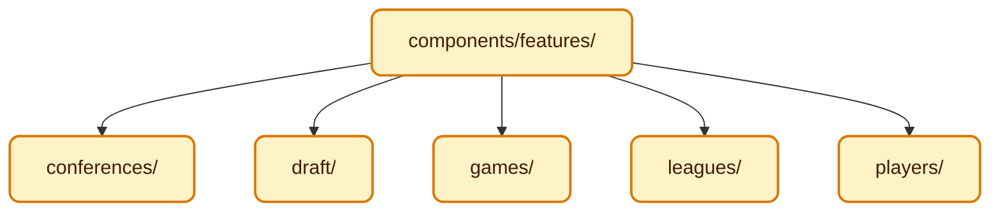

# Project Map — components/features

```mermaid
flowchart TB
  classDef folder fill:#fef3c7,stroke:#d97706,stroke-width:2,color:#451a03,rx:8,ry:8
  classDef file fill:#f0fdf4,stroke:#65a30d,stroke-width:1.5,color:#422006,rx:4,ry:4
  components_features["components/features/" ]
  class components_features folder
  components_features_conferences["conferences/"]
  class components_features_conferences folder
  components_features --> components_features_conferences
  click components_features_conferences "/admin/project-map/components/features/conferences" "Open conferences"
  components_features_draft["draft/"]
  class components_features_draft folder
  components_features --> components_features_draft
  click components_features_draft "/admin/project-map/components/features/draft" "Open draft"
  components_features_games["games/"]
  class components_features_games folder
  components_features --> components_features_games
  click components_features_games "/admin/project-map/components/features/games" "Open games"
  components_features_leagues["leagues/"]
  class components_features_leagues folder
  components_features --> components_features_leagues
  click components_features_leagues "/admin/project-map/components/features/leagues" "Open leagues"
  components_features_players["players/"]
  class components_features_players folder
  components_features --> components_features_players
  click components_features_players "/admin/project-map/components/features/players" "Open players"
```
