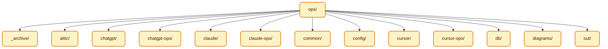

# Project Map — ops

```mermaid
flowchart TB
  classDef folder fill:#fef3c7,stroke:#d97706,stroke-width:2,color:#451a03,rx:8,ry:8
  classDef file fill:#f0fdf4,stroke:#65a30d,stroke-width:1.5,color:#422006,rx:4,ry:4
  R["ops/"]
  class R folder
  ops__archive_["_archive/"]
  class ops__archive_ folder
  R --> ops__archive_
  click ops__archive_ "/admin/project-map/ops/_archive" "Open _archive"
  ops_attic_["attic/"]
  class ops_attic_ folder
  R --> ops_attic_
  click ops_attic_ "/admin/project-map/ops/attic" "Open attic"
  ops_chatgpt_["chatgpt/"]
  class ops_chatgpt_ folder
  R --> ops_chatgpt_
  click ops_chatgpt_ "/admin/project-map/ops/chatgpt" "Open chatgpt"
  ops_chatgpt_ops_["chatgpt-ops/"]
  class ops_chatgpt_ops_ folder
  R --> ops_chatgpt_ops_
  click ops_chatgpt_ops_ "/admin/project-map/ops/chatgpt-ops" "Open chatgpt-ops"
  ops_claude_["claude/"]
  class ops_claude_ folder
  R --> ops_claude_
  click ops_claude_ "/admin/project-map/ops/claude" "Open claude"
  ops_claude_ops_["claude-ops/"]
  class ops_claude_ops_ folder
  R --> ops_claude_ops_
  click ops_claude_ops_ "/admin/project-map/ops/claude-ops" "Open claude-ops"
  ops_common_["common/"]
  class ops_common_ folder
  R --> ops_common_
  click ops_common_ "/admin/project-map/ops/common" "Open common"
  ops_config_["config/"]
  class ops_config_ folder
  R --> ops_config_
  click ops_config_ "/admin/project-map/ops/config" "Open config"
  ops_cursor_["cursor/"]
  class ops_cursor_ folder
  R --> ops_cursor_
  click ops_cursor_ "/admin/project-map/ops/cursor" "Open cursor"
  ops_cursor_ops_["cursor-ops/"]
  class ops_cursor_ops_ folder
  R --> ops_cursor_ops_
  click ops_cursor_ops_ "/admin/project-map/ops/cursor-ops" "Open cursor-ops"
  ops_db_["db/"]
  class ops_db_ folder
  R --> ops_db_
  click ops_db_ "/admin/project-map/ops/db" "Open db"
  ops_diagrams_["diagrams/"]
  class ops_diagrams_ folder
  R --> ops_diagrams_
  click ops_diagrams_ "/admin/project-map/ops/diagrams" "Open diagrams"
  ops_out_["out/"]
  class ops_out_ folder
  R --> ops_out_
  click ops_out_ "/admin/project-map/ops/out" "Open out"
```
