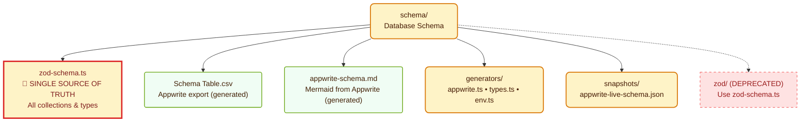

<!-- Auto-updated schema overview. For live view on Admin page, uses Appwrite API. -->
# Project Map — schema

```mermaid
flowchart TB
  classDef folder fill:#fef3c7,stroke:#d97706,stroke-width:2,color:#451a03,rx:8,ry:8
  classDef file fill:#f0fdf4,stroke:#65a30d,stroke-width:1.5,color:#422006,rx:4,ry:4
  classDef ssot fill:#fef3c7,stroke:#dc2626,stroke-width:3,color:#7f1d1d
  classDef deleted fill:#fee2e2,stroke:#ef4444,stroke-width:1,stroke-dasharray:5 5,color:#991b1b
  
  R["schema/<br/>Database Schema"]
  class R folder
  
  %% SSOT - Single Source of Truth
  zod_schema["zod-schema.ts<br/>🎯 SINGLE SOURCE OF TRUTH<br/>All collections & types"]
  class zod_schema ssot
  R --> zod_schema
  
  %% Live exports and generators
  schema_table["Schema Table.csv<br/>Appwrite export (generated)"]
  class schema_table file
  R --> schema_table
  
  appwrite_schema["appwrite-schema.md<br/>Mermaid from Appwrite (generated)"]
  class appwrite_schema file
  R --> appwrite_schema
  
  generators["generators/<br/>appwrite.ts • types.ts • env.ts"]
  class generators folder
  R --> generators
  click generators "/admin/project-map/schema/generators" "Open generators"
  
  snapshots["snapshots/<br/>appwrite-live-schema.json"]
  class snapshots folder
  R --> snapshots
  
  %% Reference (deprecated structure)
  schema_zod_deleted["zod/ (DEPRECATED)<br/>Use zod-schema.ts"]
  class schema_zod_deleted deleted
  R -.-> schema_zod_deleted
```

Last updated: auto via ops/diagrams/export-live-schema-mermaid.ts