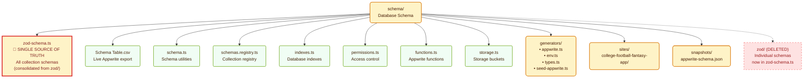

# Project Map — schema

```mermaid
flowchart TB
  classDef folder fill:#fef3c7,stroke:#d97706,stroke-width:2,color:#451a03,rx:8,ry:8
  classDef file fill:#f0fdf4,stroke:#65a30d,stroke-width:1.5,color:#422006,rx:4,ry:4
  classDef ssot fill:#fef3c7,stroke:#dc2626,stroke-width:3,color:#7f1d1d
  classDef deleted fill:#fee2e2,stroke:#ef4444,stroke-width:1,stroke-dasharray:5 5,color:#991b1b
  
  R["schema/<br/>Database Schema"]
  class R folder
  
  %% SSOT - Single Source of Truth
  zod_schema["zod-schema.ts<br/>🎯 SINGLE SOURCE OF TRUTH<br/>All collection schemas<br/>(consolidated from zod/)"]
  class zod_schema ssot
  R --> zod_schema
  
  %% Core schema files
  schema_table["Schema Table.csv<br/>Live Appwrite export"]
  class schema_table file
  R --> schema_table
  
  schema_ts["schema.ts<br/>Schema utilities"]
  class schema_ts file
  R --> schema_ts
  
  schemas_registry["schemas.registry.ts<br/>Collection registry"]
  class schemas_registry file
  R --> schemas_registry
  
  indexes_ts["indexes.ts<br/>Database indexes"]
  class indexes_ts file
  R --> indexes_ts
  
  permissions_ts["permissions.ts<br/>Access control"]
  class permissions_ts file
  R --> permissions_ts
  
  functions_ts["functions.ts<br/>Appwrite functions"]
  class functions_ts file
  R --> functions_ts
  
  storage_ts["storage.ts<br/>Storage buckets"]
  class storage_ts file
  R --> storage_ts
  
  %% Folders
  schema_generators_["generators/<br/>• appwrite.ts<br/>• env.ts<br/>• types.ts<br/>• seed-appwrite.ts"]
  class schema_generators_ folder
  R --> schema_generators_
  click schema_generators_ "/admin/project-map/schema/generators" "Open generators"
  
  schema_sites_["sites/<br/>college-football-fantasy-app/"]
  class schema_sites_ folder
  R --> schema_sites_
  
  schema_snapshots_["snapshots/<br/>appwrite-schema.json"]
  class schema_snapshots_ folder
  R --> schema_snapshots_
  
  %% Deleted folder (for reference)
  schema_zod_deleted["zod/ (DELETED)<br/>Individual schemas<br/>now in zod-schema.ts"]
  class schema_zod_deleted deleted
  R -.-> schema_zod_deleted
```
