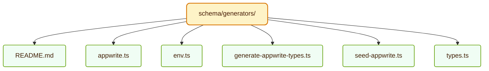

# Project Map — schema/generators

```mermaid
flowchart TB
  classDef folder fill:#fef3c7,stroke:#d97706,stroke-width:2,color:#451a03,rx:8,ry:8
  classDef file fill:#f0fdf4,stroke:#65a30d,stroke-width:1.5,color:#422006,rx:4,ry:4
  schema_generators["schema/generators/" ]
  class schema_generators folder
  schema_generators_README_md["README.md"]
  class schema_generators_README_md file
  schema_generators --> schema_generators_README_md
  schema_generators_appwrite_ts["appwrite.ts"]
  class schema_generators_appwrite_ts file
  schema_generators --> schema_generators_appwrite_ts
  schema_generators_env_ts["env.ts"]
  class schema_generators_env_ts file
  schema_generators --> schema_generators_env_ts
  schema_generators_generate_appwrite_types_ts["generate-appwrite-types.ts"]
  class schema_generators_generate_appwrite_types_ts file
  schema_generators --> schema_generators_generate_appwrite_types_ts
  schema_generators_seed_appwrite_ts["seed-appwrite.ts"]
  class schema_generators_seed_appwrite_ts file
  schema_generators --> schema_generators_seed_appwrite_ts
  schema_generators_types_ts["types.ts"]
  class schema_generators_types_ts file
  schema_generators --> schema_generators_types_ts
```
