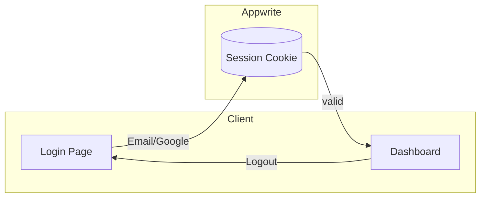

# Auth User Flow

1. Visit login → choose provider (email, Google)
2. Authenticate → Appwrite session cookie set
3. Redirect to dashboard or intended page
4. Session refresh on navigation; logout clears session

Related: ../overview/auth.md

