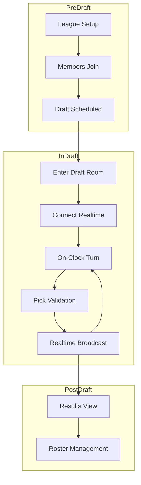

# Draft User Flow

Pre-draft:
- League setup → members join → draft scheduled

In-draft:
- Enter draft room → load state → subscribe realtime
- Turn UI: round/pick, time remaining, on-clock team
- Pick: validate → submit → realtime broadcast → advance

Post-draft:
- Results view → export board → roster management

Related: ../overview/draft.md

