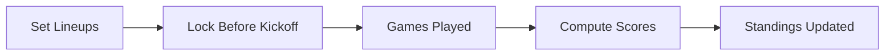

# Scoring User Flow

Season week:
- Set lineups → lock before kickoff → games played → scores computed

Commissioner:
- Review weekly results → resolve disputes → finalize standings

Related: ../overview/scoring.md

