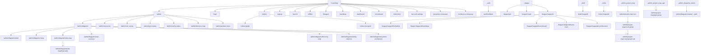

```mermaid
graph TD
  root["/ (Landing)"]
  root --> _admin["/admin"]
  root --> _login["/login"]
  root --> _videos["/videos"]
  root --> _signup["/signup"]
  root --> _launch["/launch"]
  root --> _offline["/offline"]
  root --> __league_["/(league)"]
  root --> _standings["/standings"]
  root --> _dashboard["/dashboard"]
  root --> _scoreboard["/scoreboard"]
  _league --> _league_join["/league/join"]
  root --> _client_brief["/client-brief"]
  _videos --> _videos_guide["/videos/guide"]
  _auth --> _auth_callback["/auth/callback"]
  _league --> _league_create["/league/create"]
  _admin --> _admin_diagrams["/admin/diagrams"]
  _draft --> _draft_:leagueId["/draft/:leagueId"]
  _admin --> _admin_resources["/admin/resources"]
  _videos --> _videos_:program["/videos/:program"]
  _admin --> _admin_sec_survey["/admin/sec-survey"]
  root --> _account_settings["/account-settings"]
  _invite --> _invite_:leagueId["/invite/:leagueId"]
  _league --> _league_:leagueId["/league/:leagueId"]
  _admin --> _admin_sync_status["/admin/sync-status"]
  _admin --> _admin_cache_status["/admin/cache-status"]
  _admin --> _admin_directory_map["/admin/directory-map"]
  root --> _projection_showcase["/projection-showcase"]
  root --> _conference_showcase["/conference-showcase"]
  _admin --> _admin_product_vision["/admin/product-vision"]
  _admin_diagrams --> _admin_diagrams_draft["/admin/diagrams/draft"]
  _admin_diagrams --> _admin_diagrams_:slug["/admin/diagrams/:slug"]
  _admin_project_map --> _admin_project_map_:root["/admin/project-map/:root"]
  _admin_diagrams --> _admin_diagrams_site_map["/admin/diagrams/site-map"]
  _league_:leagueId --> _league_:leagueId_schedule["/league/:leagueId/schedule"]
  _league_:leagueId --> _league_:leagueId_standings["/league/:leagueId/standings"]
  _league_:leagueId --> _league_:leagueId_scoreboard["/league/:leagueId/scoreboard"]
  _admin_diagrams --> _admin_diagrams_user_journeys["/admin/diagrams/user-journeys"]
  _admin_diagrams --> _admin_diagrams_directory_map["/admin/diagrams/directory-map"]
  _admin_project_map_app --> _admin_project_map_app_:group["/admin/project-map/app/:group"]
  _league_:leagueId --> _league_:leagueId_locker_room["/league/:leagueId/locker-room"]
  _league_:leagueId --> _league_:leagueId_commissioner["/league/:leagueId/commissioner"]
  _admin_project_map_:root --> _admin_project_map_:root_:group["/admin/project-map/:root/:group"]
  _admin_diagrams_viewer --> _admin_diagrams_viewer_:___path["/admin/diagrams/viewer/:...path"]
  _admin_diagrams --> _admin_diagrams_entity_relations["/admin/diagrams/entity-relations"]
  _admin_diagrams --> _admin_diagrams_system_architecture["/admin/diagrams/system-architecture"]
  _admin_diagrams_site_map --> _admin_diagrams_site_map_final_table["/admin/diagrams/site-map/final-table"]
  _admin_project_map_:root_:group --> _admin_project_map_:root_:group_:sub["/admin/project-map/:root/:group/:sub"]
```