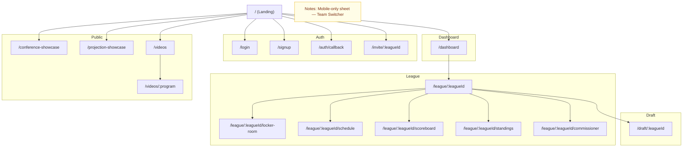

### Purpose

Active mobile sitemap in inverted tree form (top → down), mirroring web where applicable.

```mermaid
flowchart TD
  ROOT["/ (Landing)"]

  subgraph AUTH["Auth"]
    A0["/login"]
    A1["/signup"]
    A2["/auth/callback"]
    A3["/invite/:leagueId"]
  end

  subgraph DASH["Dashboard"]
    D0["/dashboard"]
  end

  subgraph LEAGUE["League"]
    L0["/league/:leagueId"]
    L1["/league/:leagueId/locker-room"]
    L2["/league/:leagueId/schedule"]
    L3["/league/:leagueId/scoreboard"]
    L4["/league/:leagueId/standings"]
    L5["/league/:leagueId/commissioner"]
  end

  subgraph DRAFT["Draft"]
    R0["/draft/:leagueId"]
  end

  subgraph PUBLIC["Public"]
    P0["/conference-showcase"]
    P1["/projection-showcase"]
    P2["/videos"]
    P3["/videos/:program"]
  end

  %% Edges
  ROOT --> A0
  ROOT --> A1
  ROOT --> A2
  ROOT --> A3
  ROOT --> D0
  D0 --> L0
  L0 --> L1
  L0 --> L2
  L0 --> L3
  L0 --> L4
  L0 --> L5
  L0 --> R0
  ROOT --> P0
  ROOT --> P1
  ROOT --> P2
  P2 --> P3

  %% Mobile-only note
  Note1["Notes: Mobile-only sheet — Team Switcher"]:::note
  classDef note fill:#FFFDE7,stroke:#EAB308,color:#7C2D12
```
