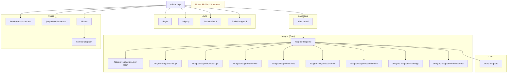

### Purpose

Final/target mobile sitemap in inverted tree form.

```mermaid
flowchart TD
  ROOT["/ (Landing)"]

  subgraph AUTH["Auth"]
    A0["/login"]
    A1["/signup"]
    A2["/auth/callback"]
    A3["/invite/:leagueId"]
  end

  subgraph DASH["Dashboard"]
    D0["/dashboard"]
  end

  subgraph LEAGUE["League (Final)"]
    L0["/league/:leagueId"]
    L1["/league/:leagueId/locker-room"]
    L2["/league/:leagueId/lineups"]
    L3["/league/:leagueId/matchups"]
    L4["/league/:leagueId/waivers"]
    L5["/league/:leagueId/trades"]
    L6["/league/:leagueId/schedule"]
    L7["/league/:leagueId/scoreboard"]
    L8["/league/:leagueId/standings"]
    L9["/league/:leagueId/commissioner"]
  end

  subgraph DRAFT["Draft"]
    R0["/draft/:leagueId"]
  end

  subgraph PUBLIC["Public"]
    P0["/conference-showcase"]
    P1["/projection-showcase"]
    P2["/videos"]
    P3["/videos/:program"]
  end

  ROOT --> A0
  ROOT --> A1
  ROOT --> A2
  ROOT --> A3
  ROOT --> D0
  D0 --> L0
  L0 --> L1
  L0 --> L2
  L0 --> L3
  L0 --> L4
  L0 --> L5
  L0 --> L6
  L0 --> L7
  L0 --> L8
  L0 --> L9
  L0 --> R0
  ROOT --> P0
  ROOT --> P1
  ROOT --> P2
  P2 --> P3

  %% Notes / external links
  Note1["Notes: Mobile UX patterns"]:::note
  classDef note fill:#FFFDE7,stroke:#EAB308,color:#7C2D12
  click Note1 "https://lucid.app/doc/your-doc#?page=abc" "Open design notes" _blank
```
