### Purpose

Active (current) site map for the web experience in inverted tree form (top → down).

### Method

Generated from the live Next.js App Router by `ops/diagrams/generate-sitemap-from-routes.ts`.

```mermaid
flowchart TD
  %% Sections folded by domain; retain all routes via hub nodes
  ROOT["/ (Landing)"]

  subgraph AUTH["Auth"]
    A0["/login"]
    A1["/signup"]
    A2["/auth/callback"]
    A3["/invite/:leagueId"]
  end

  subgraph DASH["Dashboard"]
    D0["/dashboard"]
    D1["/account-settings"]
    D2["/scoreboard"]
    D3["/standings"]
    D4["/client-brief"]
  end

  subgraph LEAGUE["League"]
    L0["/league/:leagueId"]
    L1["/league/join"]
    L2["/league/create"]
  end

  subgraph DRAFT["Draft"]
    R0["/draft/:leagueId"]
  end

  subgraph ADMIN["Admin"]
    AD0["/admin"]
  end

  subgraph PUBLIC["Public"]
    P0["/conference-showcase"]
    P1["/projection-showcase"]
    P2["/videos"]
    P4["/launch"]
    P5["/offline"]
  end

  ROOT --> A0
  ROOT --> A1
  ROOT --> A2
  ROOT --> A3
  ROOT --> D0
  ROOT --> D1
  ROOT --> D2
  ROOT --> D3
  ROOT --> D4
  ROOT --> L1
  ROOT --> L2
  ROOT --> L0
  ROOT --> R0
  ROOT --> AD0
  ROOT --> P0
  ROOT --> P1
  ROOT --> P2
  ROOT --> P4
  ROOT --> P5

  %% Click mappings (open in new tab where external)
  click L0 "/admin/diagrams/user-journeys%3Aleagues-user-flow" "Open leagues journey" _blank
```

### Legend

- Inverted tree: root at top, branches expand downward
- Role/time gates indicated inline (e.g., role: commissioner, time-gated)
- Admin/tools grouped for brevity
