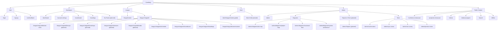

### Purpose

Final/target web sitemap as inverted tree (top → down). Future/planned routes denoted in parentheses.

```mermaid
graph TD
  root["/ (Landing)"]

  root --> auth[Auth]
  auth --> login["/login"]
  auth --> signup["/signup"]
  auth --> oauth["/auth/callback"]

  root --> dash[Dashboard]
  dash --> dhome["/dashboard"]
  dash --> acct["/account-settings"]
  dash --> scb["/scoreboard"]
  dash --> std["/standings"]
  dash --> myteams["My Teams (planned)"]

  root --> league[League]
  league --> create["/league/create"]
  league --> lid["/league/:leagueId"]
  lid --> lr["/league/:leagueId/locker-room"]
  lid --> lineups["/league/:leagueId/lineups (planned)"]
  lid --> matchups["/league/:leagueId/matchups (planned)"]
  lid --> waivers["/league/:leagueId/waivers (planned)"]
  lid --> trades["/league/:leagueId/trades (planned)"]
  lid --> sched["/league/:leagueId/schedule"]
  lid --> lscore["/league/:leagueId/scoreboard"]
  lid --> lstand["/league/:leagueId/standings"]
  lid --> comm["/league/:leagueId/commissioner"]

  root --> draft[Draft]
  draft --> draftId["/draft/:leagueId (time-gated)"]
  draft --> mock["Mock Draft (planned)"]

  root --> admin[Admin]
  admin --> aroot["/admin"]
  admin --> diags[Diagrams]
  diags --> sm["/admin/diagrams/site-map"]
  diags --> pm["/admin/diagrams/project-map"]
  diags --> ff["/admin/diagrams/functional-flow"]
  diags --> sa["/admin/diagrams/system-architecture"]
  admin --> reports["Reports & Tools (planned)"]
  reports --> arep["Admin Reports (planned)"]
  admin --> tools[Tools]
  tools --> cache["/admin/cache-status"]
  tools --> sync["/admin/sync-status"]
  tools --> sec["/admin/sec-survey"]
  tools --> pv["/admin/product-vision"]

  root --> public[Public Content]
  public --> conf["/conference-showcase"]
  public --> proj["/projection-showcase"]
  public --> vids["/videos"]
  public --> vprog["/videos/:program"]
  public --> launch["/launch"]
  public --> offline["/offline"]
```
