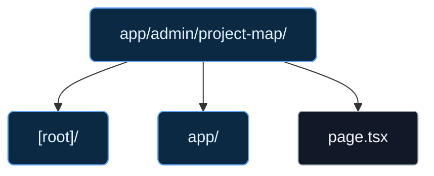

# Project Map — app/admin/project-map

```mermaid
flowchart TB
  classDef folder fill:#0b2942,stroke:#60a5fa,stroke-width:1.2,color:#e5f2ff,rx:6,ry:6
  classDef file fill:#111827,stroke:#9ca3af,stroke-width:1,color:#f3f4f6,rx:4,ry:4
  app_admin_project_map["app/admin/project-map/" ]
  class app_admin_project_map folder
  app_admin_project_map__root_["[root]/"]
  class app_admin_project_map__root_ folder
  app_admin_project_map --> app_admin_project_map__root_
  app_admin_project_map_app["app/"]
  class app_admin_project_map_app folder
  app_admin_project_map --> app_admin_project_map_app
  app_admin_project_map_page_tsx["page.tsx"]
  class app_admin_project_map_page_tsx file
  app_admin_project_map --> app_admin_project_map_page_tsx
```
