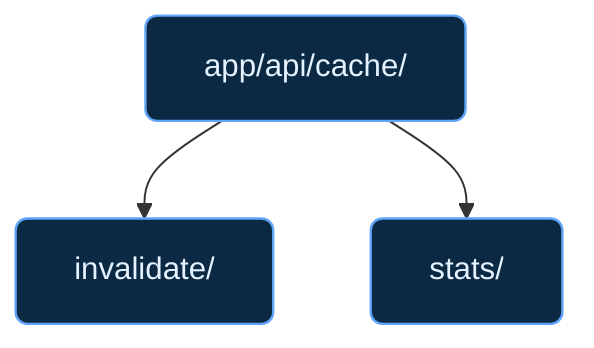

# Project Map — app/api/cache

```mermaid
flowchart TB
  classDef folder fill:#0b2942,stroke:#60a5fa,stroke-width:1.2,color:#e5f2ff,rx:6,ry:6
  classDef file fill:#111827,stroke:#9ca3af,stroke-width:1,color:#f3f4f6,rx:4,ry:4
  app_api_cache["app/api/cache/" ]
  class app_api_cache folder
  app_api_cache_invalidate["invalidate/"]
  class app_api_cache_invalidate folder
  app_api_cache --> app_api_cache_invalidate
  app_api_cache_stats["stats/"]
  class app_api_cache_stats folder
  app_api_cache --> app_api_cache_stats
```
