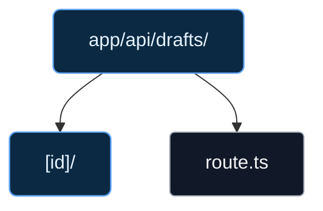

# Project Map — app/api/drafts

```mermaid
flowchart TB
  classDef folder fill:#0b2942,stroke:#60a5fa,stroke-width:1.2,color:#e5f2ff,rx:6,ry:6
  classDef file fill:#111827,stroke:#9ca3af,stroke-width:1,color:#f3f4f6,rx:4,ry:4
  app_api_drafts["app/api/drafts/" ]
  class app_api_drafts folder
  app_api_drafts__id_["[id]/"]
  class app_api_drafts__id_ folder
  app_api_drafts --> app_api_drafts__id_
  app_api_drafts_route_ts["route.ts"]
  class app_api_drafts_route_ts file
  app_api_drafts --> app_api_drafts_route_ts
```
