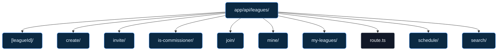

# Project Map — app/api/leagues

```mermaid
flowchart TB
  classDef folder fill:#0b2942,stroke:#60a5fa,stroke-width:1.2,color:#e5f2ff,rx:6,ry:6
  classDef file fill:#111827,stroke:#9ca3af,stroke-width:1,color:#f3f4f6,rx:4,ry:4
  app_api_leagues["app/api/leagues/" ]
  class app_api_leagues folder
  app_api_leagues__leagueId_["[leagueId]/"]
  class app_api_leagues__leagueId_ folder
  app_api_leagues --> app_api_leagues__leagueId_
  app_api_leagues_create["create/"]
  class app_api_leagues_create folder
  app_api_leagues --> app_api_leagues_create
  app_api_leagues_invite["invite/"]
  class app_api_leagues_invite folder
  app_api_leagues --> app_api_leagues_invite
  app_api_leagues_is_commissioner["is-commissioner/"]
  class app_api_leagues_is_commissioner folder
  app_api_leagues --> app_api_leagues_is_commissioner
  app_api_leagues_join["join/"]
  class app_api_leagues_join folder
  app_api_leagues --> app_api_leagues_join
  app_api_leagues_mine["mine/"]
  class app_api_leagues_mine folder
  app_api_leagues --> app_api_leagues_mine
  app_api_leagues_my_leagues["my-leagues/"]
  class app_api_leagues_my_leagues folder
  app_api_leagues --> app_api_leagues_my_leagues
  app_api_leagues_route_ts["route.ts"]
  class app_api_leagues_route_ts file
  app_api_leagues --> app_api_leagues_route_ts
  app_api_leagues_schedule["schedule/"]
  class app_api_leagues_schedule folder
  app_api_leagues --> app_api_leagues_schedule
  app_api_leagues_search["search/"]
  class app_api_leagues_search folder
  app_api_leagues --> app_api_leagues_search
```
