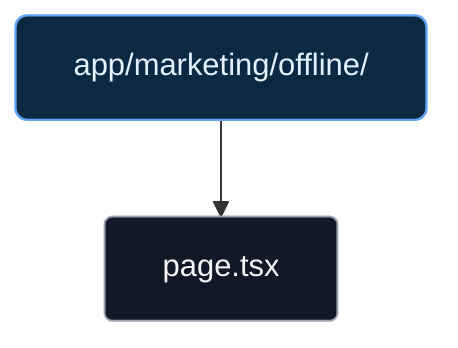

# Project Map — app/marketing/offline

```mermaid
flowchart TB
  classDef folder fill:#0b2942,stroke:#60a5fa,stroke-width:1.2,color:#e5f2ff,rx:6,ry:6
  classDef file fill:#111827,stroke:#9ca3af,stroke-width:1,color:#f3f4f6,rx:4,ry:4
  app_marketing_offline["app/marketing/offline/" ]
  class app_marketing_offline folder
  app_marketing_offline_page_tsx["page.tsx"]
  class app_marketing_offline_page_tsx file
  app_marketing_offline --> app_marketing_offline_page_tsx
```
