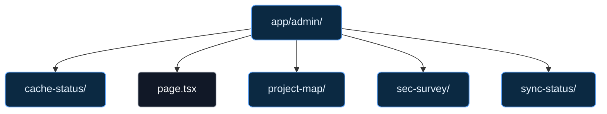

# Project Map — app/admin

```mermaid
flowchart TB
  classDef folder fill:#0b2942,stroke:#60a5fa,stroke-width:1.2,color:#e5f2ff,rx:6,ry:6
  classDef file fill:#111827,stroke:#9ca3af,stroke-width:1,color:#f3f4f6,rx:4,ry:4
  app_admin["app/admin/" ]
  class app_admin folder
  app_admin_cache_status["cache-status/"]
  class app_admin_cache_status folder
  app_admin --> app_admin_cache_status
  click app_admin_cache_status "/admin/project-map/app/admin/cache-status" "Open cache-status"
  app_admin_page_tsx["page.tsx"]
  class app_admin_page_tsx file
  app_admin --> app_admin_page_tsx
  app_admin_project_map["project-map/"]
  class app_admin_project_map folder
  app_admin --> app_admin_project_map
  click app_admin_project_map "/admin/project-map/app/admin/project-map" "Open project-map"
  app_admin_sec_survey["sec-survey/"]
  class app_admin_sec_survey folder
  app_admin --> app_admin_sec_survey
  click app_admin_sec_survey "/admin/project-map/app/admin/sec-survey" "Open sec-survey"
  app_admin_sync_status["sync-status/"]
  class app_admin_sync_status folder
  app_admin --> app_admin_sync_status
  click app_admin_sync_status "/admin/project-map/app/admin/sync-status" "Open sync-status"
```
