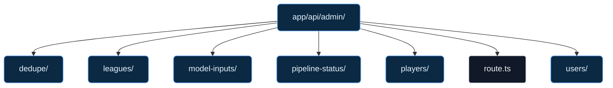

# Project Map — app/api/admin

```mermaid
flowchart TB
  classDef folder fill:#0b2942,stroke:#60a5fa,stroke-width:1.2,color:#e5f2ff,rx:6,ry:6
  classDef file fill:#111827,stroke:#9ca3af,stroke-width:1,color:#f3f4f6,rx:4,ry:4
  app_api_admin["app/api/admin/" ]
  class app_api_admin folder
  app_api_admin_dedupe["dedupe/"]
  class app_api_admin_dedupe folder
  app_api_admin --> app_api_admin_dedupe
  app_api_admin_leagues["leagues/"]
  class app_api_admin_leagues folder
  app_api_admin --> app_api_admin_leagues
  app_api_admin_model_inputs["model-inputs/"]
  class app_api_admin_model_inputs folder
  app_api_admin --> app_api_admin_model_inputs
  app_api_admin_pipeline_status["pipeline-status/"]
  class app_api_admin_pipeline_status folder
  app_api_admin --> app_api_admin_pipeline_status
  app_api_admin_players["players/"]
  class app_api_admin_players folder
  app_api_admin --> app_api_admin_players
  app_api_admin_route_ts["route.ts"]
  class app_api_admin_route_ts file
  app_api_admin --> app_api_admin_route_ts
  app_api_admin_users["users/"]
  class app_api_admin_users folder
  app_api_admin --> app_api_admin_users
```
