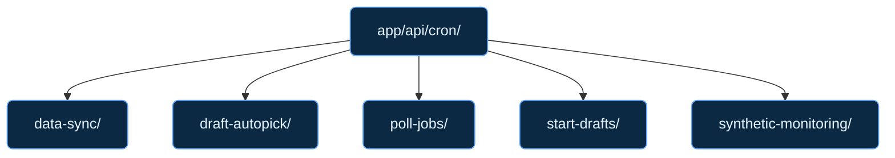

# Project Map — app/api/cron

```mermaid
flowchart TB
  classDef folder fill:#0b2942,stroke:#60a5fa,stroke-width:1.2,color:#e5f2ff,rx:6,ry:6
  classDef file fill:#111827,stroke:#9ca3af,stroke-width:1,color:#f3f4f6,rx:4,ry:4
  app_api_cron["app/api/cron/" ]
  class app_api_cron folder
  app_api_cron_data_sync["data-sync/"]
  class app_api_cron_data_sync folder
  app_api_cron --> app_api_cron_data_sync
  app_api_cron_draft_autopick["draft-autopick/"]
  class app_api_cron_draft_autopick folder
  app_api_cron --> app_api_cron_draft_autopick
  app_api_cron_poll_jobs["poll-jobs/"]
  class app_api_cron_poll_jobs folder
  app_api_cron --> app_api_cron_poll_jobs
  app_api_cron_start_drafts["start-drafts/"]
  class app_api_cron_start_drafts folder
  app_api_cron --> app_api_cron_start_drafts
  app_api_cron_synthetic_monitoring["synthetic-monitoring/"]
  class app_api_cron_synthetic_monitoring folder
  app_api_cron --> app_api_cron_synthetic_monitoring
```
