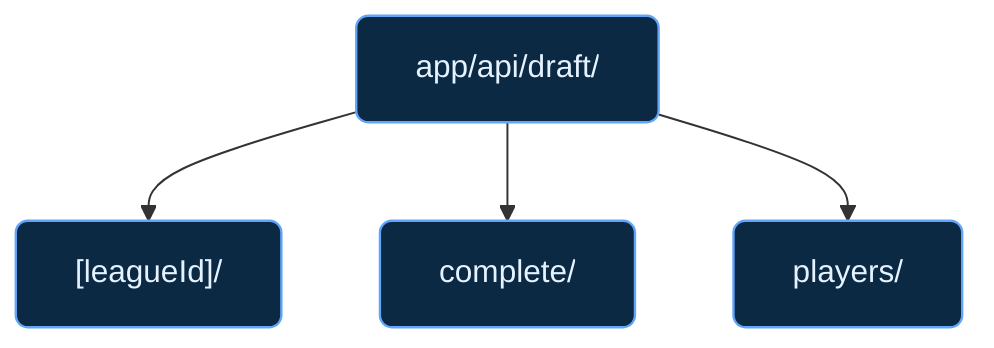

# Project Map — app/api/draft

```mermaid
flowchart TB
  classDef folder fill:#0b2942,stroke:#60a5fa,stroke-width:1.2,color:#e5f2ff,rx:6,ry:6
  classDef file fill:#111827,stroke:#9ca3af,stroke-width:1,color:#f3f4f6,rx:4,ry:4
  app_api_draft["app/api/draft/" ]
  class app_api_draft folder
  app_api_draft__leagueId_["[leagueId]/"]
  class app_api_draft__leagueId_ folder
  app_api_draft --> app_api_draft__leagueId_
  app_api_draft_complete["complete/"]
  class app_api_draft_complete folder
  app_api_draft --> app_api_draft_complete
  app_api_draft_players["players/"]
  class app_api_draft_players folder
  app_api_draft --> app_api_draft_players
```
