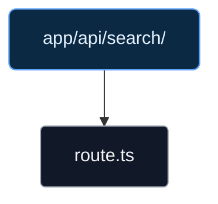

# Project Map — app/api/search

```mermaid
flowchart TB
  classDef folder fill:#0b2942,stroke:#60a5fa,stroke-width:1.2,color:#e5f2ff,rx:6,ry:6
  classDef file fill:#111827,stroke:#9ca3af,stroke-width:1,color:#f3f4f6,rx:4,ry:4
  app_api_search["app/api/search/" ]
  class app_api_search folder
  app_api_search_route_ts["route.ts"]
  class app_api_search_route_ts file
  app_api_search --> app_api_search_route_ts
```
