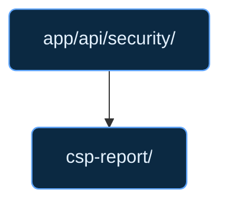

# Project Map — app/api/security

```mermaid
flowchart TB
  classDef folder fill:#0b2942,stroke:#60a5fa,stroke-width:1.2,color:#e5f2ff,rx:6,ry:6
  classDef file fill:#111827,stroke:#9ca3af,stroke-width:1,color:#f3f4f6,rx:4,ry:4
  app_api_security["app/api/security/" ]
  class app_api_security folder
  app_api_security_csp_report["csp-report/"]
  class app_api_security_csp_report folder
  app_api_security --> app_api_security_csp_report
```
