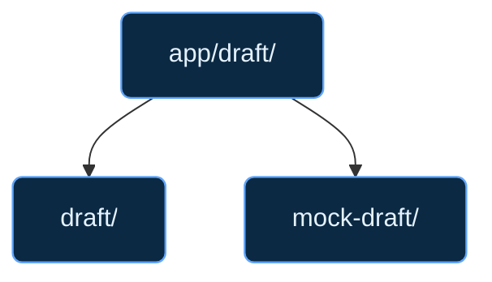

# Project Map — app/draft

```mermaid
flowchart TB
  classDef folder fill:#0b2942,stroke:#60a5fa,stroke-width:1.2,color:#e5f2ff,rx:6,ry:6
  classDef file fill:#111827,stroke:#9ca3af,stroke-width:1,color:#f3f4f6,rx:4,ry:4
  app_draft["app/draft/" ]
  class app_draft folder
  app_draft_draft["draft/"]
  class app_draft_draft folder
  app_draft --> app_draft_draft
  click app_draft_draft "/admin/project-map/app/draft/draft" "Open draft"
  app_draft_mock_draft["mock-draft/"]
  class app_draft_mock_draft folder
  app_draft --> app_draft_mock_draft
  click app_draft_mock_draft "/admin/project-map/app/draft/mock-draft" "Open mock-draft"
```
