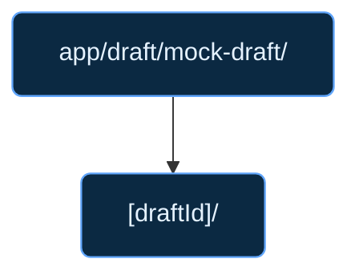

# Project Map — app/draft/mock-draft

```mermaid
flowchart TB
  classDef folder fill:#0b2942,stroke:#60a5fa,stroke-width:1.2,color:#e5f2ff,rx:6,ry:6
  classDef file fill:#111827,stroke:#9ca3af,stroke-width:1,color:#f3f4f6,rx:4,ry:4
  app_draft_mock_draft["app/draft/mock-draft/" ]
  class app_draft_mock_draft folder
  app_draft_mock_draft__draftId_["[draftId]/"]
  class app_draft_mock_draft__draftId_ folder
  app_draft_mock_draft --> app_draft_mock_draft__draftId_
```
