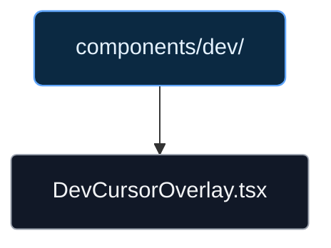

# Project Map — components/dev

```mermaid
flowchart TB
  classDef folder fill:#0b2942,stroke:#60a5fa,stroke-width:1.2,color:#e5f2ff,rx:6,ry:6
  classDef file fill:#111827,stroke:#9ca3af,stroke-width:1,color:#f3f4f6,rx:4,ry:4
  components_dev["components/dev/" ]
  class components_dev folder
  components_dev_DevCursorOverlay_tsx["DevCursorOverlay.tsx"]
  class components_dev_DevCursorOverlay_tsx file
  components_dev --> components_dev_DevCursorOverlay_tsx
```
