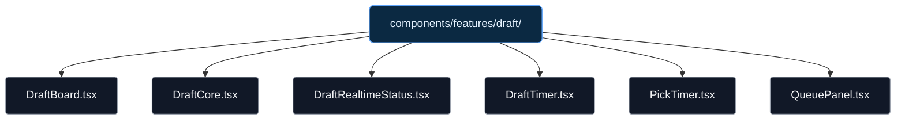

# Project Map — components/features/draft

```mermaid
flowchart TB
  classDef folder fill:#0b2942,stroke:#60a5fa,stroke-width:1.2,color:#e5f2ff,rx:6,ry:6
  classDef file fill:#111827,stroke:#9ca3af,stroke-width:1,color:#f3f4f6,rx:4,ry:4
  components_features_draft["components/features/draft/" ]
  class components_features_draft folder
  components_features_draft_DraftBoard_tsx["DraftBoard.tsx"]
  class components_features_draft_DraftBoard_tsx file
  components_features_draft --> components_features_draft_DraftBoard_tsx
  components_features_draft_DraftCore_tsx["DraftCore.tsx"]
  class components_features_draft_DraftCore_tsx file
  components_features_draft --> components_features_draft_DraftCore_tsx
  components_features_draft_DraftRealtimeStatus_tsx["DraftRealtimeStatus.tsx"]
  class components_features_draft_DraftRealtimeStatus_tsx file
  components_features_draft --> components_features_draft_DraftRealtimeStatus_tsx
  components_features_draft_DraftTimer_tsx["DraftTimer.tsx"]
  class components_features_draft_DraftTimer_tsx file
  components_features_draft --> components_features_draft_DraftTimer_tsx
  components_features_draft_PickTimer_tsx["PickTimer.tsx"]
  class components_features_draft_PickTimer_tsx file
  components_features_draft --> components_features_draft_PickTimer_tsx
  components_features_draft_QueuePanel_tsx["QueuePanel.tsx"]
  class components_features_draft_QueuePanel_tsx file
  components_features_draft --> components_features_draft_QueuePanel_tsx
```
