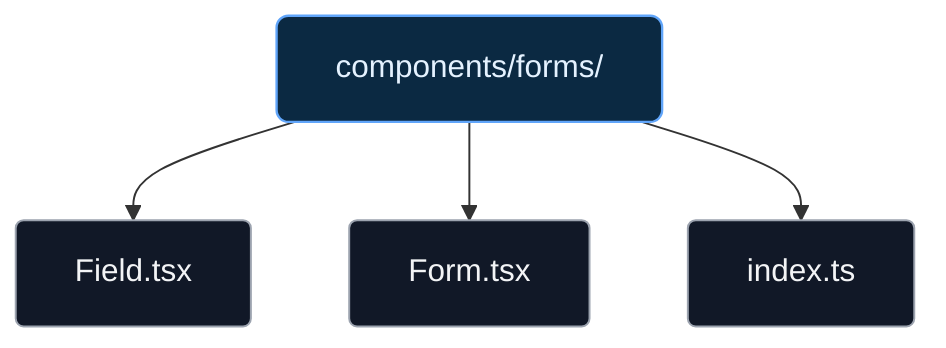

# Project Map — components/forms

```mermaid
flowchart TB
  classDef folder fill:#0b2942,stroke:#60a5fa,stroke-width:1.2,color:#e5f2ff,rx:6,ry:6
  classDef file fill:#111827,stroke:#9ca3af,stroke-width:1,color:#f3f4f6,rx:4,ry:4
  components_forms["components/forms/" ]
  class components_forms folder
  components_forms_Field_tsx["Field.tsx"]
  class components_forms_Field_tsx file
  components_forms --> components_forms_Field_tsx
  components_forms_Form_tsx["Form.tsx"]
  class components_forms_Form_tsx file
  components_forms --> components_forms_Form_tsx
  components_forms_index_ts["index.ts"]
  class components_forms_index_ts file
  components_forms --> components_forms_index_ts
```
