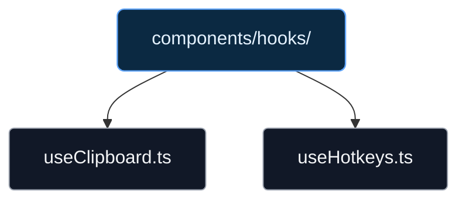

# Project Map — components/hooks

```mermaid
flowchart TB
  classDef folder fill:#0b2942,stroke:#60a5fa,stroke-width:1.2,color:#e5f2ff,rx:6,ry:6
  classDef file fill:#111827,stroke:#9ca3af,stroke-width:1,color:#f3f4f6,rx:4,ry:4
  components_hooks["components/hooks/" ]
  class components_hooks folder
  components_hooks_useClipboard_ts["useClipboard.ts"]
  class components_hooks_useClipboard_ts file
  components_hooks --> components_hooks_useClipboard_ts
  components_hooks_useHotkeys_ts["useHotkeys.ts"]
  class components_hooks_useHotkeys_ts file
  components_hooks --> components_hooks_useHotkeys_ts
```
