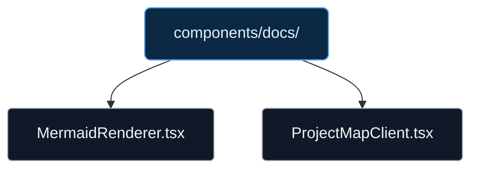

# Project Map — components/docs

```mermaid
flowchart TB
  classDef folder fill:#0b2942,stroke:#60a5fa,stroke-width:1.2,color:#e5f2ff,rx:6,ry:6
  classDef file fill:#111827,stroke:#9ca3af,stroke-width:1,color:#f3f4f6,rx:4,ry:4
  components_docs["components/docs/" ]
  class components_docs folder
  components_docs_MermaidRenderer_tsx["MermaidRenderer.tsx"]
  class components_docs_MermaidRenderer_tsx file
  components_docs --> components_docs_MermaidRenderer_tsx
  components_docs_ProjectMapClient_tsx["ProjectMapClient.tsx"]
  class components_docs_ProjectMapClient_tsx file
  components_docs --> components_docs_ProjectMapClient_tsx
```
