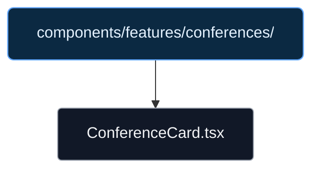

# Project Map — components/features/conferences

```mermaid
flowchart TB
  classDef folder fill:#0b2942,stroke:#60a5fa,stroke-width:1.2,color:#e5f2ff,rx:6,ry:6
  classDef file fill:#111827,stroke:#9ca3af,stroke-width:1,color:#f3f4f6,rx:4,ry:4
  components_features_conferences["components/features/conferences/" ]
  class components_features_conferences folder
  components_features_conferences_ConferenceCard_tsx["ConferenceCard.tsx"]
  class components_features_conferences_ConferenceCard_tsx file
  components_features_conferences --> components_features_conferences_ConferenceCard_tsx
```
