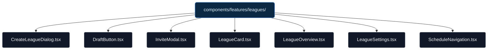

# Project Map — components/features/leagues

```mermaid
flowchart TB
  classDef folder fill:#0b2942,stroke:#60a5fa,stroke-width:1.2,color:#e5f2ff,rx:6,ry:6
  classDef file fill:#111827,stroke:#9ca3af,stroke-width:1,color:#f3f4f6,rx:4,ry:4
  components_features_leagues["components/features/leagues/" ]
  class components_features_leagues folder
  components_features_leagues_CreateLeagueDialog_tsx["CreateLeagueDialog.tsx"]
  class components_features_leagues_CreateLeagueDialog_tsx file
  components_features_leagues --> components_features_leagues_CreateLeagueDialog_tsx
  components_features_leagues_DraftButton_tsx["DraftButton.tsx"]
  class components_features_leagues_DraftButton_tsx file
  components_features_leagues --> components_features_leagues_DraftButton_tsx
  components_features_leagues_InviteModal_tsx["InviteModal.tsx"]
  class components_features_leagues_InviteModal_tsx file
  components_features_leagues --> components_features_leagues_InviteModal_tsx
  components_features_leagues_LeagueCard_tsx["LeagueCard.tsx"]
  class components_features_leagues_LeagueCard_tsx file
  components_features_leagues --> components_features_leagues_LeagueCard_tsx
  components_features_leagues_LeagueOverview_tsx["LeagueOverview.tsx"]
  class components_features_leagues_LeagueOverview_tsx file
  components_features_leagues --> components_features_leagues_LeagueOverview_tsx
  components_features_leagues_LeagueSettings_tsx["LeagueSettings.tsx"]
  class components_features_leagues_LeagueSettings_tsx file
  components_features_leagues --> components_features_leagues_LeagueSettings_tsx
  components_features_leagues_ScheduleNavigation_tsx["ScheduleNavigation.tsx"]
  class components_features_leagues_ScheduleNavigation_tsx file
  components_features_leagues --> components_features_leagues_ScheduleNavigation_tsx
```
