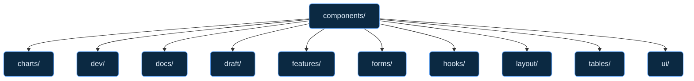

# Project Map — components

```mermaid
flowchart TB
  classDef folder fill:#0b2942,stroke:#60a5fa,stroke-width:1.2,color:#e5f2ff,rx:6,ry:6
  classDef file fill:#111827,stroke:#9ca3af,stroke-width:1,color:#f3f4f6,rx:4,ry:4
  R["components/"]
  class R folder
  components_charts_["charts/"]
  class components_charts_ folder
  R --> components_charts_
  click components_charts_ "/admin/project-map/components/charts" "Open charts"
  components_dev_["dev/"]
  class components_dev_ folder
  R --> components_dev_
  click components_dev_ "/admin/project-map/components/dev" "Open dev"
  components_docs_["docs/"]
  class components_docs_ folder
  R --> components_docs_
  click components_docs_ "/admin/project-map/components/docs" "Open docs"
  components_draft_["draft/"]
  class components_draft_ folder
  R --> components_draft_
  click components_draft_ "/admin/project-map/components/draft" "Open draft"
  components_features_["features/"]
  class components_features_ folder
  R --> components_features_
  click components_features_ "/admin/project-map/components/features" "Open features"
  components_forms_["forms/"]
  class components_forms_ folder
  R --> components_forms_
  click components_forms_ "/admin/project-map/components/forms" "Open forms"
  components_hooks_["hooks/"]
  class components_hooks_ folder
  R --> components_hooks_
  click components_hooks_ "/admin/project-map/components/hooks" "Open hooks"
  components_layout_["layout/"]
  class components_layout_ folder
  R --> components_layout_
  click components_layout_ "/admin/project-map/components/layout" "Open layout"
  components_tables_["tables/"]
  class components_tables_ folder
  R --> components_tables_
  click components_tables_ "/admin/project-map/components/tables" "Open tables"
  components_ui_["ui/"]
  class components_ui_ folder
  R --> components_ui_
  click components_ui_ "/admin/project-map/components/ui" "Open ui"
```
