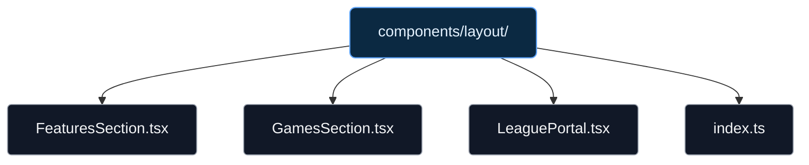

# Project Map — components/layout

```mermaid
flowchart TB
  classDef folder fill:#0b2942,stroke:#60a5fa,stroke-width:1.2,color:#e5f2ff,rx:6,ry:6
  classDef file fill:#111827,stroke:#9ca3af,stroke-width:1,color:#f3f4f6,rx:4,ry:4
  components_layout["components/layout/" ]
  class components_layout folder
  components_layout_FeaturesSection_tsx["FeaturesSection.tsx"]
  class components_layout_FeaturesSection_tsx file
  components_layout --> components_layout_FeaturesSection_tsx
  components_layout_GamesSection_tsx["GamesSection.tsx"]
  class components_layout_GamesSection_tsx file
  components_layout --> components_layout_GamesSection_tsx
  components_layout_LeaguePortal_tsx["LeaguePortal.tsx"]
  class components_layout_LeaguePortal_tsx file
  components_layout --> components_layout_LeaguePortal_tsx
  components_layout_index_ts["index.ts"]
  class components_layout_index_ts file
  components_layout --> components_layout_index_ts
```
