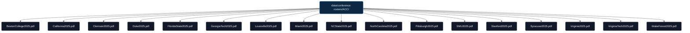

# Project Map — data/conference rosters/ACC

```mermaid
flowchart TB
  classDef folder fill:#0b2942,stroke:#60a5fa,stroke-width:1.2,color:#e5f2ff,rx:6,ry:6
  classDef file fill:#111827,stroke:#9ca3af,stroke-width:1,color:#f3f4f6,rx:4,ry:4
  data_conference_rosters_ACC["data/conference rosters/ACC/" ]
  class data_conference_rosters_ACC folder
  data_conference_rosters_ACC_BostonCollege2025_pdf["BostonCollege2025.pdf"]
  class data_conference_rosters_ACC_BostonCollege2025_pdf file
  data_conference_rosters_ACC --> data_conference_rosters_ACC_BostonCollege2025_pdf
  data_conference_rosters_ACC_California2025_pdf["California2025.pdf"]
  class data_conference_rosters_ACC_California2025_pdf file
  data_conference_rosters_ACC --> data_conference_rosters_ACC_California2025_pdf
  data_conference_rosters_ACC_Clemson2025_pdf["Clemson2025.pdf"]
  class data_conference_rosters_ACC_Clemson2025_pdf file
  data_conference_rosters_ACC --> data_conference_rosters_ACC_Clemson2025_pdf
  data_conference_rosters_ACC_Duke2025_pdf["Duke2025.pdf"]
  class data_conference_rosters_ACC_Duke2025_pdf file
  data_conference_rosters_ACC --> data_conference_rosters_ACC_Duke2025_pdf
  data_conference_rosters_ACC_FloridaState2025_pdf["FloridaState2025.pdf"]
  class data_conference_rosters_ACC_FloridaState2025_pdf file
  data_conference_rosters_ACC --> data_conference_rosters_ACC_FloridaState2025_pdf
  data_conference_rosters_ACC_GeorgiaTech2025_pdf["GeorgiaTech2025.pdf"]
  class data_conference_rosters_ACC_GeorgiaTech2025_pdf file
  data_conference_rosters_ACC --> data_conference_rosters_ACC_GeorgiaTech2025_pdf
  data_conference_rosters_ACC_Louisville2025_pdf["Louisville2025.pdf"]
  class data_conference_rosters_ACC_Louisville2025_pdf file
  data_conference_rosters_ACC --> data_conference_rosters_ACC_Louisville2025_pdf
  data_conference_rosters_ACC_Miami2025_pdf["Miami2025.pdf"]
  class data_conference_rosters_ACC_Miami2025_pdf file
  data_conference_rosters_ACC --> data_conference_rosters_ACC_Miami2025_pdf
  data_conference_rosters_ACC_NCState2025_pdf["NCState2025.pdf"]
  class data_conference_rosters_ACC_NCState2025_pdf file
  data_conference_rosters_ACC --> data_conference_rosters_ACC_NCState2025_pdf
  data_conference_rosters_ACC_NorthCarolina2025_pdf["NorthCarolina2025.pdf"]
  class data_conference_rosters_ACC_NorthCarolina2025_pdf file
  data_conference_rosters_ACC --> data_conference_rosters_ACC_NorthCarolina2025_pdf
  data_conference_rosters_ACC_Pittsburgh2025_pdf["Pittsburgh2025.pdf"]
  class data_conference_rosters_ACC_Pittsburgh2025_pdf file
  data_conference_rosters_ACC --> data_conference_rosters_ACC_Pittsburgh2025_pdf
  data_conference_rosters_ACC_SMU2025_pdf["SMU2025.pdf"]
  class data_conference_rosters_ACC_SMU2025_pdf file
  data_conference_rosters_ACC --> data_conference_rosters_ACC_SMU2025_pdf
  data_conference_rosters_ACC_Stanford2025_pdf["Stanford2025.pdf"]
  class data_conference_rosters_ACC_Stanford2025_pdf file
  data_conference_rosters_ACC --> data_conference_rosters_ACC_Stanford2025_pdf
  data_conference_rosters_ACC_Syracuse2025_pdf["Syracuse2025.pdf"]
  class data_conference_rosters_ACC_Syracuse2025_pdf file
  data_conference_rosters_ACC --> data_conference_rosters_ACC_Syracuse2025_pdf
  data_conference_rosters_ACC_Virginia2025_pdf["Virginia2025.pdf"]
  class data_conference_rosters_ACC_Virginia2025_pdf file
  data_conference_rosters_ACC --> data_conference_rosters_ACC_Virginia2025_pdf
  data_conference_rosters_ACC_VirginiaTech2025_pdf["VirginiaTech2025.pdf"]
  class data_conference_rosters_ACC_VirginiaTech2025_pdf file
  data_conference_rosters_ACC --> data_conference_rosters_ACC_VirginiaTech2025_pdf
  data_conference_rosters_ACC_WakeForest2025_pdf["WakeForest2025.pdf"]
  class data_conference_rosters_ACC_WakeForest2025_pdf file
  data_conference_rosters_ACC --> data_conference_rosters_ACC_WakeForest2025_pdf
```
