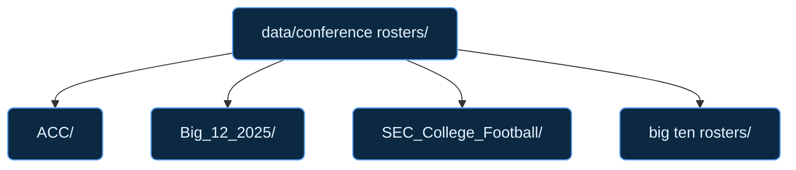

# Project Map — data/conference rosters

```mermaid
flowchart TB
  classDef folder fill:#0b2942,stroke:#60a5fa,stroke-width:1.2,color:#e5f2ff,rx:6,ry:6
  classDef file fill:#111827,stroke:#9ca3af,stroke-width:1,color:#f3f4f6,rx:4,ry:4
  data_conference_rosters["data/conference rosters/" ]
  class data_conference_rosters folder
  data_conference_rosters_ACC["ACC/"]
  class data_conference_rosters_ACC folder
  data_conference_rosters --> data_conference_rosters_ACC
  click data_conference_rosters_ACC "/admin/project-map/data/conference rosters/ACC" "Open ACC"
  data_conference_rosters_Big_12_2025["Big_12_2025/"]
  class data_conference_rosters_Big_12_2025 folder
  data_conference_rosters --> data_conference_rosters_Big_12_2025
  click data_conference_rosters_Big_12_2025 "/admin/project-map/data/conference rosters/Big_12_2025" "Open Big_12_2025"
  data_conference_rosters_SEC_College_Football["SEC_College_Football/"]
  class data_conference_rosters_SEC_College_Football folder
  data_conference_rosters --> data_conference_rosters_SEC_College_Football
  click data_conference_rosters_SEC_College_Football "/admin/project-map/data/conference rosters/SEC_College_Football" "Open SEC_College_Football"
  data_conference_rosters_big_ten_rosters["big ten rosters/"]
  class data_conference_rosters_big_ten_rosters folder
  data_conference_rosters --> data_conference_rosters_big_ten_rosters
  click data_conference_rosters_big_ten_rosters "/admin/project-map/data/conference rosters/big ten rosters" "Open big ten rosters"
```
