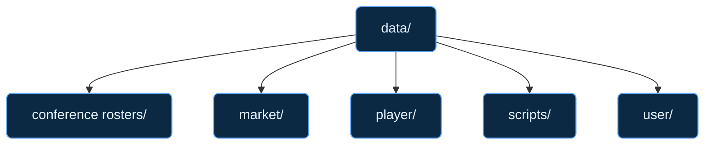

# Project Map — data

```mermaid
flowchart TB
  classDef folder fill:#0b2942,stroke:#60a5fa,stroke-width:1.2,color:#e5f2ff,rx:6,ry:6
  classDef file fill:#111827,stroke:#9ca3af,stroke-width:1,color:#f3f4f6,rx:4,ry:4
  R["data/"]
  class R folder
  data_conference_rosters_["conference rosters/"]
  class data_conference_rosters_ folder
  R --> data_conference_rosters_
  click data_conference_rosters_ "/admin/project-map/data/conference rosters" "Open conference rosters"
  data_market_["market/"]
  class data_market_ folder
  R --> data_market_
  click data_market_ "/admin/project-map/data/market" "Open market"
  data_player_["player/"]
  class data_player_ folder
  R --> data_player_
  click data_player_ "/admin/project-map/data/player" "Open player"
  data_scripts_["scripts/"]
  class data_scripts_ folder
  R --> data_scripts_
  click data_scripts_ "/admin/project-map/data/scripts" "Open scripts"
  data_user_["user/"]
  class data_user_ folder
  R --> data_user_
  click data_user_ "/admin/project-map/data/user" "Open user"
```
