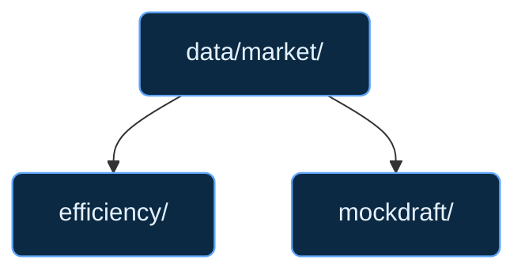

# Project Map — data/market

```mermaid
flowchart TB
  classDef folder fill:#0b2942,stroke:#60a5fa,stroke-width:1.2,color:#e5f2ff,rx:6,ry:6
  classDef file fill:#111827,stroke:#9ca3af,stroke-width:1,color:#f3f4f6,rx:4,ry:4
  data_market["data/market/" ]
  class data_market folder
  data_market_efficiency["efficiency/"]
  class data_market_efficiency folder
  data_market --> data_market_efficiency
  click data_market_efficiency "/admin/project-map/data/market/efficiency" "Open efficiency"
  data_market_mockdraft["mockdraft/"]
  class data_market_mockdraft folder
  data_market --> data_market_mockdraft
  click data_market_mockdraft "/admin/project-map/data/market/mockdraft" "Open mockdraft"
```
