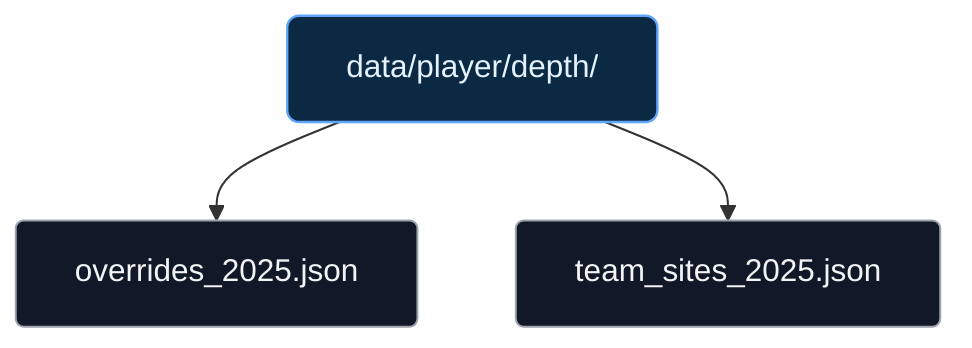

# Project Map — data/player/depth

```mermaid
flowchart TB
  classDef folder fill:#0b2942,stroke:#60a5fa,stroke-width:1.2,color:#e5f2ff,rx:6,ry:6
  classDef file fill:#111827,stroke:#9ca3af,stroke-width:1,color:#f3f4f6,rx:4,ry:4
  data_player_depth["data/player/depth/" ]
  class data_player_depth folder
  data_player_depth_overrides_2025_json["overrides_2025.json"]
  class data_player_depth_overrides_2025_json file
  data_player_depth --> data_player_depth_overrides_2025_json
  data_player_depth_team_sites_2025_json["team_sites_2025.json"]
  class data_player_depth_team_sites_2025_json file
  data_player_depth --> data_player_depth_team_sites_2025_json
```
