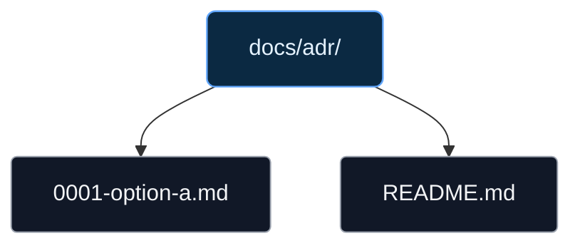

# Project Map — docs/adr

```mermaid
flowchart TB
  classDef folder fill:#0b2942,stroke:#60a5fa,stroke-width:1.2,color:#e5f2ff,rx:6,ry:6
  classDef file fill:#111827,stroke:#9ca3af,stroke-width:1,color:#f3f4f6,rx:4,ry:4
  docs_adr["docs/adr/" ]
  class docs_adr folder
  docs_adr_0001_option_a_md["0001-option-a.md"]
  class docs_adr_0001_option_a_md file
  docs_adr --> docs_adr_0001_option_a_md
  docs_adr_README_md["README.md"]
  class docs_adr_README_md file
  docs_adr --> docs_adr_README_md
```
