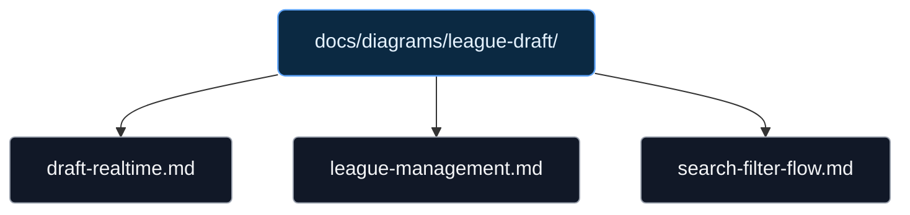

# Project Map — docs/diagrams/league-draft

```mermaid
flowchart TB
  classDef folder fill:#0b2942,stroke:#60a5fa,stroke-width:1.2,color:#e5f2ff,rx:6,ry:6
  classDef file fill:#111827,stroke:#9ca3af,stroke-width:1,color:#f3f4f6,rx:4,ry:4
  docs_diagrams_league_draft["docs/diagrams/league-draft/" ]
  class docs_diagrams_league_draft folder
  docs_diagrams_league_draft_draft_realtime_md["draft-realtime.md"]
  class docs_diagrams_league_draft_draft_realtime_md file
  docs_diagrams_league_draft --> docs_diagrams_league_draft_draft_realtime_md
  docs_diagrams_league_draft_league_management_md["league-management.md"]
  class docs_diagrams_league_draft_league_management_md file
  docs_diagrams_league_draft --> docs_diagrams_league_draft_league_management_md
  docs_diagrams_league_draft_search_filter_flow_md["search-filter-flow.md"]
  class docs_diagrams_league_draft_search_filter_flow_md file
  docs_diagrams_league_draft --> docs_diagrams_league_draft_search_filter_flow_md
```
