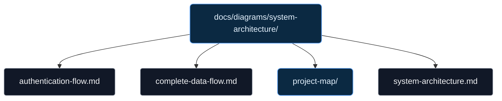

# Project Map — docs/diagrams/system-architecture

```mermaid
flowchart TB
  classDef folder fill:#0b2942,stroke:#60a5fa,stroke-width:1.2,color:#e5f2ff,rx:6,ry:6
  classDef file fill:#111827,stroke:#9ca3af,stroke-width:1,color:#f3f4f6,rx:4,ry:4
  docs_diagrams_system_architecture["docs/diagrams/system-architecture/" ]
  class docs_diagrams_system_architecture folder
  docs_diagrams_system_architecture_authentication_flow_md["authentication-flow.md"]
  class docs_diagrams_system_architecture_authentication_flow_md file
  docs_diagrams_system_architecture --> docs_diagrams_system_architecture_authentication_flow_md
  docs_diagrams_system_architecture_complete_data_flow_md["complete-data-flow.md"]
  class docs_diagrams_system_architecture_complete_data_flow_md file
  docs_diagrams_system_architecture --> docs_diagrams_system_architecture_complete_data_flow_md
  docs_diagrams_system_architecture_project_map["project-map/"]
  class docs_diagrams_system_architecture_project_map folder
  docs_diagrams_system_architecture --> docs_diagrams_system_architecture_project_map
  docs_diagrams_system_architecture_system_architecture_md["system-architecture.md"]
  class docs_diagrams_system_architecture_system_architecture_md file
  docs_diagrams_system_architecture --> docs_diagrams_system_architecture_system_architecture_md
```
