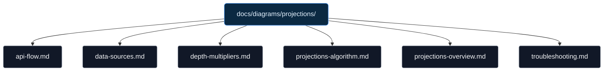

# Project Map — docs/diagrams/projections

```mermaid
flowchart TB
  classDef folder fill:#0b2942,stroke:#60a5fa,stroke-width:1.2,color:#e5f2ff,rx:6,ry:6
  classDef file fill:#111827,stroke:#9ca3af,stroke-width:1,color:#f3f4f6,rx:4,ry:4
  docs_diagrams_projections["docs/diagrams/projections/" ]
  class docs_diagrams_projections folder
  docs_diagrams_projections_api_flow_md["api-flow.md"]
  class docs_diagrams_projections_api_flow_md file
  docs_diagrams_projections --> docs_diagrams_projections_api_flow_md
  docs_diagrams_projections_data_sources_md["data-sources.md"]
  class docs_diagrams_projections_data_sources_md file
  docs_diagrams_projections --> docs_diagrams_projections_data_sources_md
  docs_diagrams_projections_depth_multipliers_md["depth-multipliers.md"]
  class docs_diagrams_projections_depth_multipliers_md file
  docs_diagrams_projections --> docs_diagrams_projections_depth_multipliers_md
  docs_diagrams_projections_projections_algorithm_md["projections-algorithm.md"]
  class docs_diagrams_projections_projections_algorithm_md file
  docs_diagrams_projections --> docs_diagrams_projections_projections_algorithm_md
  docs_diagrams_projections_projections_overview_md["projections-overview.md"]
  class docs_diagrams_projections_projections_overview_md file
  docs_diagrams_projections --> docs_diagrams_projections_projections_overview_md
  docs_diagrams_projections_troubleshooting_md["troubleshooting.md"]
  class docs_diagrams_projections_troubleshooting_md file
  docs_diagrams_projections --> docs_diagrams_projections_troubleshooting_md
```
