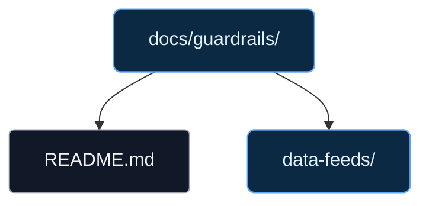

# Project Map — docs/guardrails

```mermaid
flowchart TB
  classDef folder fill:#0b2942,stroke:#60a5fa,stroke-width:1.2,color:#e5f2ff,rx:6,ry:6
  classDef file fill:#111827,stroke:#9ca3af,stroke-width:1,color:#f3f4f6,rx:4,ry:4
  docs_guardrails["docs/guardrails/" ]
  class docs_guardrails folder
  docs_guardrails_README_md["README.md"]
  class docs_guardrails_README_md file
  docs_guardrails --> docs_guardrails_README_md
  docs_guardrails_data_feeds["data-feeds/"]
  class docs_guardrails_data_feeds folder
  docs_guardrails --> docs_guardrails_data_feeds
  click docs_guardrails_data_feeds "/admin/project-map/docs/guardrails/data-feeds" "Open data-feeds"
```
