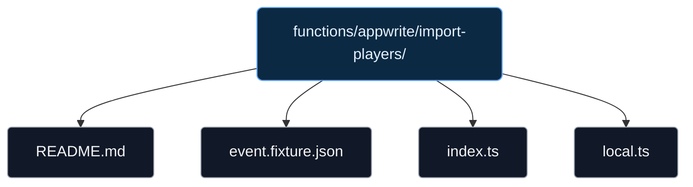

# Project Map — functions/appwrite/import-players

```mermaid
flowchart TB
  classDef folder fill:#0b2942,stroke:#60a5fa,stroke-width:1.2,color:#e5f2ff,rx:6,ry:6
  classDef file fill:#111827,stroke:#9ca3af,stroke-width:1,color:#f3f4f6,rx:4,ry:4
  functions_appwrite_import_players["functions/appwrite/import-players/" ]
  class functions_appwrite_import_players folder
  functions_appwrite_import_players_README_md["README.md"]
  class functions_appwrite_import_players_README_md file
  functions_appwrite_import_players --> functions_appwrite_import_players_README_md
  functions_appwrite_import_players_event_fixture_json["event.fixture.json"]
  class functions_appwrite_import_players_event_fixture_json file
  functions_appwrite_import_players --> functions_appwrite_import_players_event_fixture_json
  functions_appwrite_import_players_index_ts["index.ts"]
  class functions_appwrite_import_players_index_ts file
  functions_appwrite_import_players --> functions_appwrite_import_players_index_ts
  functions_appwrite_import_players_local_ts["local.ts"]
  class functions_appwrite_import_players_local_ts file
  functions_appwrite_import_players --> functions_appwrite_import_players_local_ts
```
