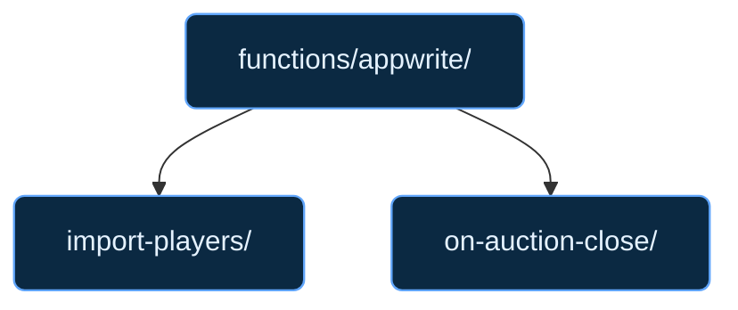

# Project Map — functions/appwrite

```mermaid
flowchart TB
  classDef folder fill:#0b2942,stroke:#60a5fa,stroke-width:1.2,color:#e5f2ff,rx:6,ry:6
  classDef file fill:#111827,stroke:#9ca3af,stroke-width:1,color:#f3f4f6,rx:4,ry:4
  functions_appwrite["functions/appwrite/" ]
  class functions_appwrite folder
  functions_appwrite_import_players["import-players/"]
  class functions_appwrite_import_players folder
  functions_appwrite --> functions_appwrite_import_players
  click functions_appwrite_import_players "/admin/project-map/functions/appwrite/import-players" "Open import-players"
  functions_appwrite_on_auction_close["on-auction-close/"]
  class functions_appwrite_on_auction_close folder
  functions_appwrite --> functions_appwrite_on_auction_close
  click functions_appwrite_on_auction_close "/admin/project-map/functions/appwrite/on-auction-close" "Open on-auction-close"
```
