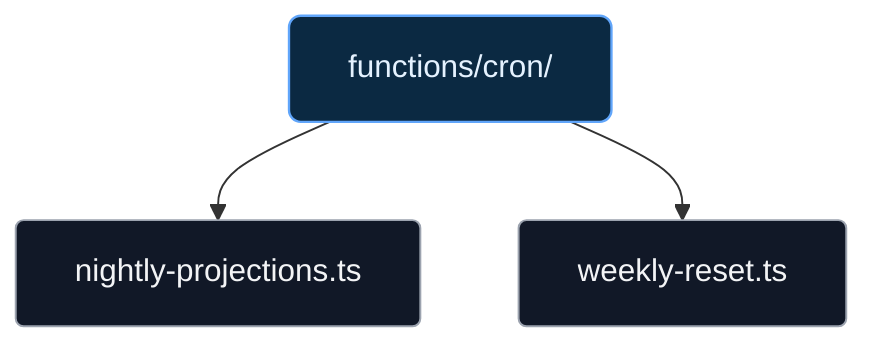

# Project Map — functions/cron

```mermaid
flowchart TB
  classDef folder fill:#0b2942,stroke:#60a5fa,stroke-width:1.2,color:#e5f2ff,rx:6,ry:6
  classDef file fill:#111827,stroke:#9ca3af,stroke-width:1,color:#f3f4f6,rx:4,ry:4
  functions_cron["functions/cron/" ]
  class functions_cron folder
  functions_cron_nightly_projections_ts["nightly-projections.ts"]
  class functions_cron_nightly_projections_ts file
  functions_cron --> functions_cron_nightly_projections_ts
  functions_cron_weekly_reset_ts["weekly-reset.ts"]
  class functions_cron_weekly_reset_ts file
  functions_cron --> functions_cron_weekly_reset_ts
```
