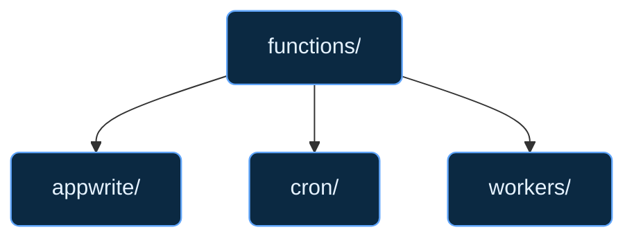

# Project Map — functions

```mermaid
flowchart TB
  classDef folder fill:#0b2942,stroke:#60a5fa,stroke-width:1.2,color:#e5f2ff,rx:6,ry:6
  classDef file fill:#111827,stroke:#9ca3af,stroke-width:1,color:#f3f4f6,rx:4,ry:4
  R["functions/"]
  class R folder
  functions_appwrite_["appwrite/"]
  class functions_appwrite_ folder
  R --> functions_appwrite_
  click functions_appwrite_ "/admin/project-map/functions/appwrite" "Open appwrite"
  functions_cron_["cron/"]
  class functions_cron_ folder
  R --> functions_cron_
  click functions_cron_ "/admin/project-map/functions/cron" "Open cron"
  functions_workers_["workers/"]
  class functions_workers_ folder
  R --> functions_workers_
  click functions_workers_ "/admin/project-map/functions/workers" "Open workers"
```
