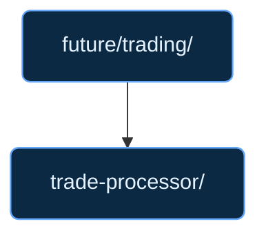

# Project Map — future/trading

```mermaid
flowchart TB
  classDef folder fill:#0b2942,stroke:#60a5fa,stroke-width:1.2,color:#e5f2ff,rx:6,ry:6
  classDef file fill:#111827,stroke:#9ca3af,stroke-width:1,color:#f3f4f6,rx:4,ry:4
  future_trading["future/trading/" ]
  class future_trading folder
  future_trading_trade_processor["trade-processor/"]
  class future_trading_trade_processor folder
  future_trading --> future_trading_trade_processor
  click future_trading_trade_processor "/admin/project-map/future/trading/trade-processor" "Open trade-processor"
```
